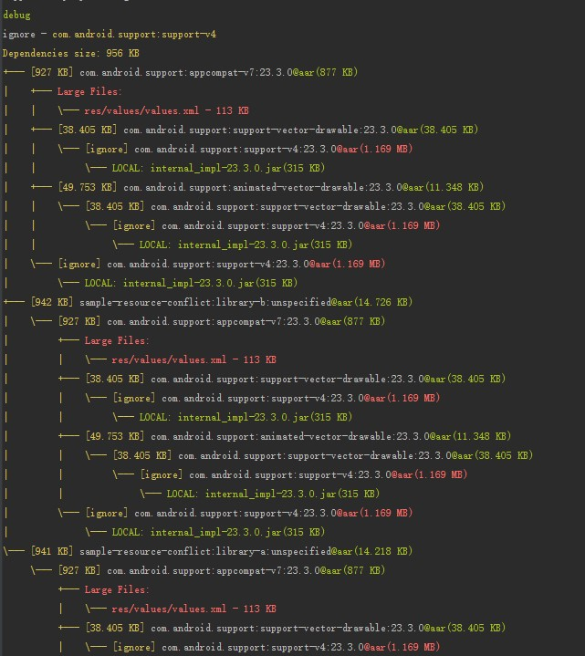

# Library Analysis Gradle Plugin

[](https://travis-ci.org/znyang/library-analysis)
[](https://jitpack.io/#znyang/library-analysis)
[](https://codecov.io/gh/znyang/library-analysis/branch/master)

## 概述

分析并统计依赖库文件的占用大小。

1. 支持大文件提醒
2. 支持忽略部分依赖库大小（不统计）

## 配置

```gradle
buildscript {
    repositories {
        // ...
        maven { url "https://jitpack.io" }
    }
    dependencies {
        classpath 'com.github.znyang:library-analysis:0.0.1'
    }
}

apply plugin: 'com.zen.lib.analysis'

libReport {
    limit {
        fileSize = 100 * 1024 // aar包中的文件比该数值大的将会被列出
        libSize = 1024 * 1024 // aar,jar文件超过该数值大小的会被红色标记
    }
    ignore = [
            "com.android.support:support-v4"
    ]
}
```

## 使用

```
gradle libraryReportDebug
```

### output



### report

**report/zen/analysis/library/debug/largeFiles.md**

| Dependency | File | Size |
| :--- | :--- | :--- |
| com.facebook.fresco:imagepipeline:0.8.1 | jni/x86_64/libimagepipeline.so | 962 KB |
| com.facebook.fresco:imagepipeline:0.8.1 | jni/arm64-v8a/libimagepipeline.so | 910 KB |
| com.facebook.fresco:imagepipeline:0.8.1 | jni/x86/libimagepipeline.so | 549 KB |
| com.facebook.fresco:imagepipeline:0.8.1 | jni/x86_64/libgifimage.so | 487 KB |
| com.facebook.fresco:imagepipeline:0.8.1 | jni/x86_64/libwebpimage.so | 471 KB |
| com.facebook.fresco:imagepipeline:0.8.1 | jni/arm64-v8a/libgifimage.so | 471 KB |
| com.facebook.fresco:imagepipeline:0.8.1 | jni/arm64-v8a/libwebpimage.so | 455 KB |