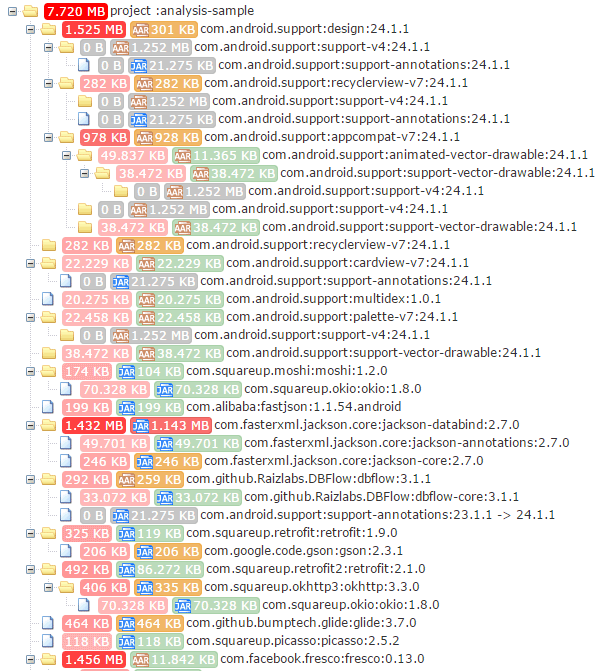

# Library Analysis Gradle Plugin

[](https://travis-ci.org/znyang/library-analysis)
[](https://jitpack.io/#znyang/library-analysis)
[](https://codecov.io/gh/znyang/library-analysis/branch/master)

## 概述

分析各依赖库文件的大小

1. 支持大文件提醒
2. 支持忽略部分依赖库大小（大小显示为灰色）
3. 支持依赖节点大小统计

## 配置

```gradle
buildscript {
    repositories {
        // ...
        maven { url "https://jitpack.io" }
    }
    dependencies {
        classpath 'com.github.znyang:library-analysis:0.1.2'
    }
}

apply plugin: 'com.zen.lib.analysis'

libReport {
    ignore = [
            "com.android.support:support-v4"
    ]
}
```

## 使用

```
gradle libReportCompile
```

### output

**/build/reports/zen/analysis/library/compile/Tree.html**

