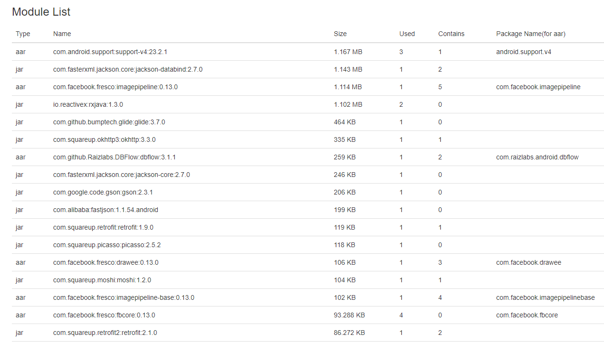

# Library Analysis Gradle Plugin

[](https://travis-ci.org/znyang/library-analysis)
[](https://jitpack.io/#znyang/library-analysis)
[](https://codecov.io/gh/znyang/library-analysis/branch/master)

## 概述

分析各依赖库文件的大小

1. 支持大文件提醒
2. 支持忽略部分依赖库大小（大小显示为灰色）
3. 支持依赖节点大小统计
4. 输出aar的PackageName以及冲突提示
5. 输出依赖库被直接依赖次数(Used)、包含的依赖库数量(Contains)
6. 标识可移除的依赖库（实验性功能）

>可移除的依赖库<br>
例如有这样的依赖关系：A->B->C, A->C，那么A~~->C~~

## 配置

```gradle
buildscript {
    repositories {
        // ...
        maven { url "https://jitpack.io" }
    }
    dependencies {
        // version from https://jitpack.io/#znyang/library-analysis
        classpath 'com.github.znyang:library-analysis:#LAST_VERSION'
    }
}

apply plugin: 'com.zen.lib.analysis'

libReport {
    output = [
        "txt", "html" // default
    ]
    ignore = [
        "com.android.support:support-v4"
    ]
}
```

## 使用

```
gradle libReportCompile // or libReportReleaseCompileClasspath ...
```

注意：在使用gradle 4.x以后，建议使用libReportReleaseCompileClasspath输出（libReportCompile无法输出使用implementation加入的相关依赖库），如果工程都只用compile添加依赖，那么没有影响。

### output

**/build/reports/zen/analysis/library/compile/Tree.html**




**/build/reports/zen/analysis/library/compile/Tree.txt**

```
  6.050 MB	       0 B	\--- project :analysis-sample
 20.275 KB	 20.275 KB	 	+--- com.android.support:multidex:1.0.1
       0 B	       0 B	 	+--- project :module-library
    174 KB	    104 KB	 	+--- com.squareup.moshi:moshi:1.2.0
 70.328 KB	 70.328 KB	 	|	\--- com.squareup.okio:okio:1.8.0
    199 KB	    199 KB	 	+--- com.alibaba:fastjson:1.1.54.android
  1.432 MB	  1.143 MB	 	+--- com.fasterxml.jackson.core:jackson-databind:2.7.0
 49.701 KB	 49.701 KB	 	|	+--- com.fasterxml.jackson.core:jackson-annotations:2.7.0
    246 KB	    246 KB	 	|	\--- com.fasterxml.jackson.core:jackson-core:2.7.0
    314 KB	    259 KB	 	+--- com.github.Raizlabs.DBFlow:dbflow:3.1.1
 33.072 KB	 33.072 KB	 	|	+--- com.github.Raizlabs.DBFlow:dbflow-core:3.1.1
 21.275 KB	 21.275 KB	 	|	\--- com.android.support:support-annotations:23.1.1 -> 24.1.0
    325 KB	    119 KB	 	+--- com.squareup.retrofit:retrofit:1.9.0
    206 KB	    206 KB	 	|	\--- com.google.code.gson:gson:2.3.1
    492 KB	 86.272 KB	 	+--- com.squareup.retrofit2:retrofit:2.1.0
    406 KB	    335 KB	 	|	\--- com.squareup.okhttp3:okhttp:3.3.0
 70.328 KB	 70.328 KB	 	|	 	\--- com.squareup.okio:okio:1.8.0
    464 KB	    464 KB	 	+--- com.github.bumptech.glide:glide:3.7.0
    118 KB	    118 KB	 	+--- com.squareup.picasso:picasso:2.5.2
  1.456 MB	 11.842 KB	 	+--- com.facebook.fresco:fresco:0.13.0
    200 KB	    106 KB	 	|	+--- com.facebook.fresco:drawee:0.13.0
       0 B	  1.167 MB	 	|	|	+--- com.android.support:support-v4:23.2.1
       0 B	 21.275 KB	 	|	|	|	\--- com.android.support:support-annotations:23.2.1 -> 24.1.0
 93.288 KB	 93.288 KB	 	|	|	\--- com.facebook.fresco:fbcore:0.13.0
 93.288 KB	 93.288 KB	 	|	+--- com.facebook.fresco:fbcore:0.13.0
  1.341 MB	  1.114 MB	 	|	\--- com.facebook.fresco:imagepipeline:0.13.0
       0 B	  1.167 MB	 	|	 	+--- com.android.support:support-v4:23.2.1
    232 KB	    102 KB	 	|	 	+--- com.facebook.fresco:imagepipeline-base:0.13.0
       0 B	  1.167 MB	 	|	 	|	+--- com.android.support:support-v4:23.2.1
 37.199 KB	 37.199 KB	 	|	 	|	+--- com.parse.bolts:bolts-tasks:1.4.0
 93.288 KB	 93.288 KB	 	|	 	|	\--- com.facebook.fresco:fbcore:0.13.0
 37.199 KB	 37.199 KB	 	|	 	+--- com.parse.bolts:bolts-tasks:1.4.0
 93.288 KB	 93.288 KB	 	|	 	\--- com.facebook.fresco:fbcore:0.13.0
 18.699 KB	 18.699 KB	 	+--- com.jakewharton.timber:timber:4.3.0
  1.111 MB	  9.466 KB	 	+--- io.reactivex:rxandroid:1.2.1
  1.102 MB	  1.102 MB	 	|	\--- io.reactivex:rxjava:1.1.6 -> 1.3.0
  1.102 MB	  1.102 MB	 	+--- io.reactivex:rxjava:1.3.0
 54.464 KB	 16.989 KB	 	+--- com.jakewharton:butterknife:8.4.0
 37.475 KB	 16.199 KB	 	|	+--- com.jakewharton:butterknife-annotations:8.4.0
 21.275 KB	 21.275 KB	 	|	|	\--- com.android.support:support-annotations:24.1.0
 21.275 KB	 21.275 KB	 	|	\--- com.android.support:support-annotations:24.1.0
  9.570 KB	  9.570 KB	 	+--- com.jakewharton.scalpel:scalpel:1.1.2
  3.603 KB	  3.603 KB	 	\--- com.jakewharton:process-phoenix:1.0.2
 ...
```
